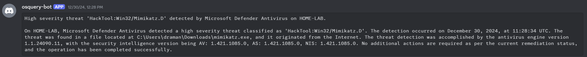

# osquery-discord-notifier
Monitor osquery logs and use an LLM to provide concise, user-friendly summaries of new events through Private Messages in Discord.

## Introduction 
osquery-discord-notifier is a python tool designed to help you monitor & notify on new osquery logs in a way that is both lightweight and powerful. By leveraging a language model, it generates concise and user-friendly summaries of new events, which are then sent directly to your Discord channel. 

This allows for quick and easy monitoring of your system's security and performance without the need to manually sift through extensive logs, or to install a complete SOAR stack (Elasticsearch, Splunk, ...) to monitor a low volume of important events.

The tool continuously monitors the osquery ``osqueryd.results.log`` file, detects newly added events, and processes them through an LLM (if configured & available - a fallback is available) before notifying you through a Private Message in Discord.

This tool is by no means a replacement for a professional, scalable ecurity monitoring service. It was developed out of the need to monitor a small set of important events in a lightweight manner within a home lab setup, and to monitor a very small number of servers for important (security) events.

## Download & Install

1. Download & install osquery (https://osquery.io/).

2. In osquery, configure all queries you want to monitor & be notified about. Make sure your queries are scheduled to run at an interval like in the examples above, so they show up in the monitored log file. More information: https://osquery.readthedocs.io/en/stable/deployment/configuration/.

3. Create and configure a new Discord bot. More information: https://discordpy.readthedocs.io/en/stable/discord.html.

4. Make a copy of ``.env.TEMPLATE`` and call it ``.env``, and complete all the variables in the file. The Discord variables are required, the LLM ones are optional.

5. Create a new virtual environment for python & install all dependencies

```
python3 -m venv .venv
source .venv/bin/activate
pip install -r requirements.txt
```

6. Start the bot
```
.venv/bin/python osquery_discord_notifier.py
```

7. If everything was configured correctly, you should now receive a test message on Discord. This confirms everything was configured successfully!


8. (Optional) ``osquery_discord_notifier.py`` does not install a service. A simple way of making sure that it's continuously running (even if it would be killed for some reason) and to survive a reboot, is to add it to the cron jobs and use ``run-one`` to guarantee exactly 1 instance is running:

```
* * * * * run-one /repos/osquery-discord-notifier/.venv/bin/python /repos/osquery-discord-notifier/osquery_discord_notifier.py > /var/log/osquery_discord_notifier.log
```

9. (Optional) You can perform a "liveness" check on the bot simply by sending it the message ``!stats``, which will respond with the server uptime:


## Example alerts

A few examples of notifications useful while monitoring a home lab environment:

### Malware download detected



Based on this osquery.conf configuration:
```
"schedule": {
    "defender_alerts": {
      "query": "SELECT * FROM windows_eventlog WHERE channel = 'Microsoft-Windows-Windows Defender/Operational' AND eventid IN (1116, 1117, 1121, 1123, 1124);",
      "interval": 5,
      "description": "Checks for Windows Defender alerts"
    }
}
```

### New startup item detected


Based on this osquery.conf configuration:
```
"schedule": {
    "startup_items": {
      "query": "SELECT * from startup_items;",
      "interval": 5,
      "description": "Checks for startup items"
    }
}
```

### New RDP Login session


Based on this osquery.conf configuration:

```
"schedule": {
    "rdp_sessions": {
        "query": "SELECT * FROM logged_in_users WHERE type = 'rdp';",
        "interval": 60,
        "description": "Checks for active RDP sessions"
    }
}
```

## Feature Wishlist

A few things we might implement in future versions of the tool

- Let the user interact with the bot by asking it follow-up questions, which are then processed by the configured Language Model (``When did you see a similar event in the past?``, ``What does S-1-5-21-500 mean?``, ``Is this event something I should worry about?``, ...).
- More commands beyond ``!stats`` (although we don't want to turn this into a potential C&C: commands should always be "read only" and not cause side-effects on the server).
- A better event loop.

## Acknowledgements

Thanks to the [osquery](https://github.com/osquery/osquery) team for building great software making this project possible.

## Contributing

We would love to hear from you on a Pull Request or Issue in this repository.   
Alternatively, you can reach out to our team at research@nviso.eu.

